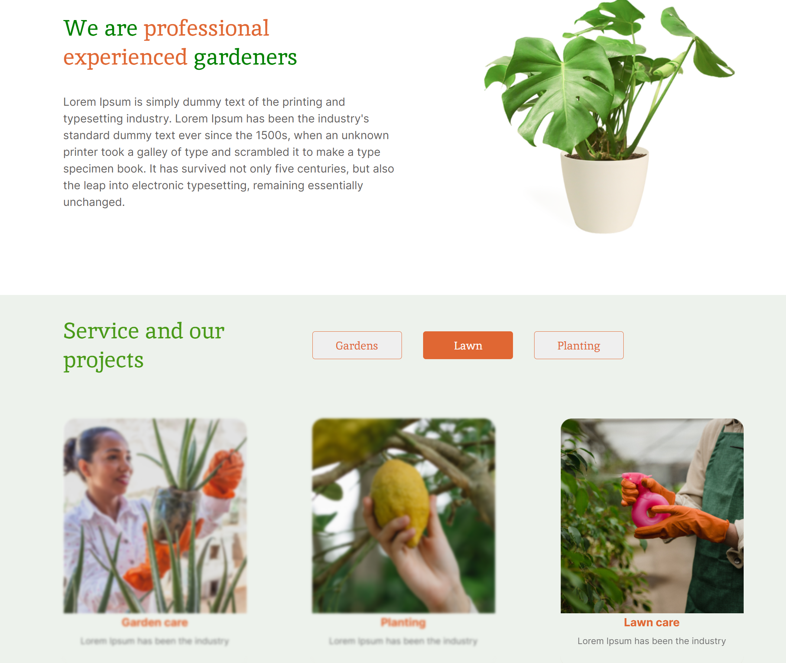

# Plants

Plants is a landing page of a website that offers its services for growing plants in the garden and caring for them, made adaptive and interactive.

## Technology Stack:

- HTML
- CSS
- JavaScript

## Demo

You can see the live demo of the project at [https://slavr7.github.io/plants/](https://slavr7.github.io/plants/)

## Installation and Usage

To run this project locally, follow these steps:

1. Clone this repository.
2. Open the `index.html` file in your web browser.

## Screenshot

## Features

- Responsive layout for different screen sizes.
- Burger menu implemented with JavaScript.
- Changing the focus on services in the "Service and our projects" section.
- Accordion in the prices section.
- Custom select in the "Contacts" section.
